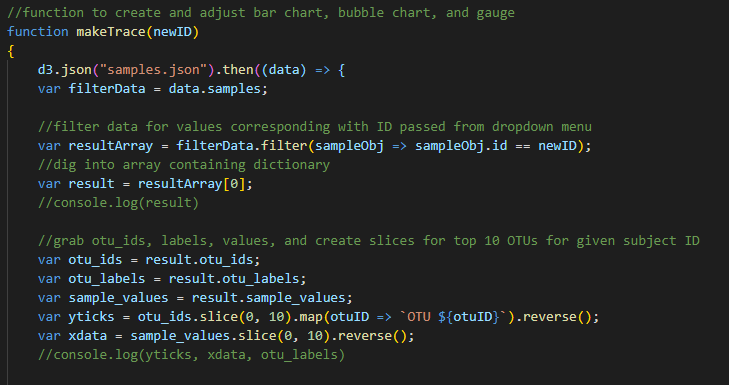
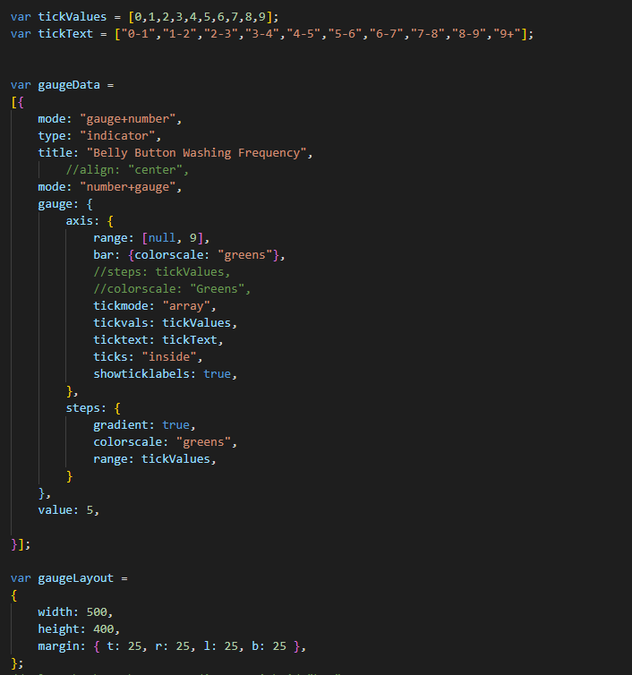

# Plotly_hw
 
One of the more satsifying assignments we've had, as it was challenging but I didn't find myself getting too stuck for too long. It was rewarding to see each graph/chart show up and start working in tandem with the dropdown menu. This assignment really helped me understand how to use "=>" functions better as well as the .filter() function.
The bubble chart felt easier than the bar chart because by the time I got started on it I'd already learned a lot about how to select the data I needed and apply it to the charts.

I really wanted to get the bonus, but I think I got caught up looking through the wrong part of the documentation because I wasn't able to get a gauge with a pointer, and it ended up looking like the examples they give in the documentation. I know I was really close to finishing it, but as of now the gauge chart is unfinished.

